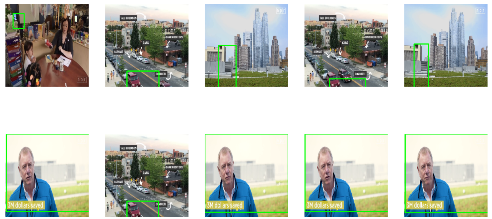
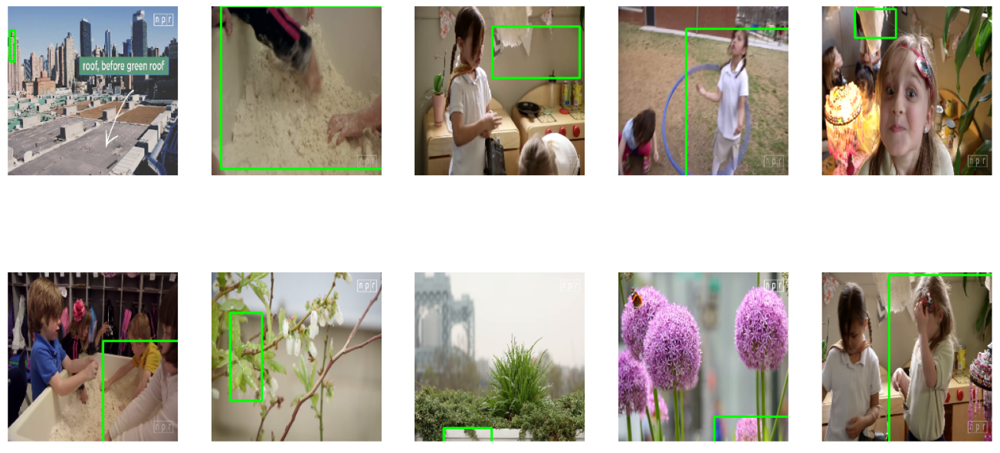
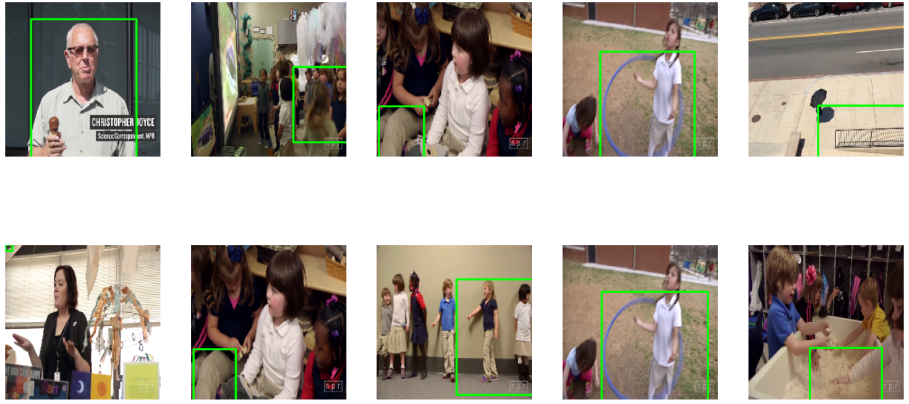
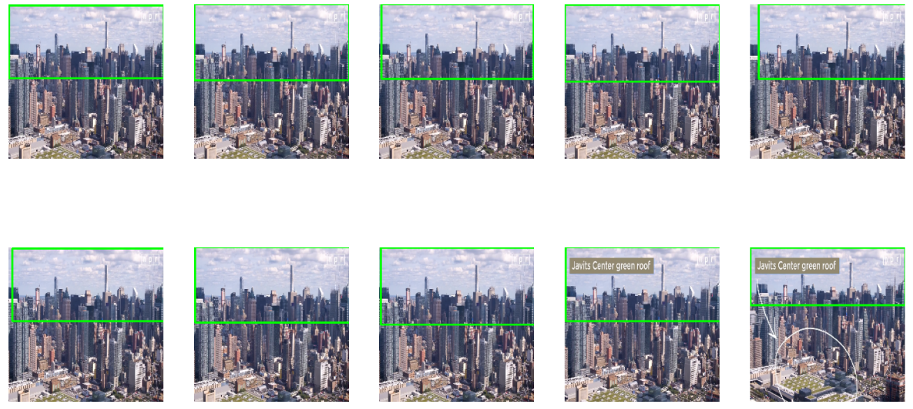
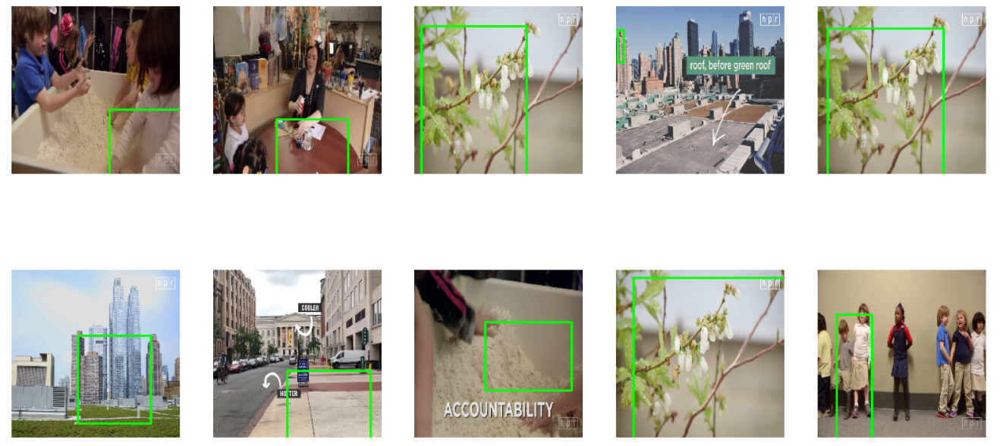

Functions were developed in `.py` files, and can be excuted by running `main.py`. And the whole process are also showcased in `main.ipynb`.

This repo is mainly targeted at showcasing the universal pipeline of indexing images via image embedding generated by the autoencoder in a postgres database, integrating object detection by faster-rcnn and autoencoder trainning on COCO dataset. Therefore, there is no task-specific faster-rcnn finetuning and autoencoder configuration. To boost the indexing accuracy for specific tasks, object detection model finetuning on target objects and careful autoencoder configuration will help.

### 0: Docker Environment setup
- Create a `docker-compose.yml` file defines a multi-container Docker application with two services: `app` and `db`.
- The `app` service is a custom application built from a Dockerfile named `Dockerfile.pytorch`, while the `db` service runs a PostgreSQL database with the `pgvector` extension, build from `db/Dockerfile`

- Build comtainers
```
docker-compose build
```

- Run container
```
docker-compose up
```
	-  To stop the containers, use docker-compose down

- Service Details
	- `app` Service:
		- Uses a custom Dockerfile for building the application image.
		- Mounts a volume from the host machine to `/workspaces/artificial_intelligence` within the container, allowing for persistent and shared data between the host and container.
			- Utilizes GPU resources
	- `db` Service:
		- Runs PostgreSQL with `pgvector` for vector database capabilities.
		- Persists data using a named volume `postgres_data`.
		- Health checks ensure the database is ready before other services (like `app`) start

This configuration provides a foundational setup for running a data-intensive application alongside a vector-enabled PostgreSQL database, leveraging Docker Compose for service management and orchestration.

- Open Jupyter Notebook
	- Set up  Jupyter Notebook ports `8888` in `docekr-compose.yml`
	- Enter command line of container `video_containe`. Run the following command
		`jupyter lab --ip 0.0.0.0 --no-browser --allow-root`
	- Open the output link and open jupyter lab
###  1. Download YouTube Videos with Caption
- **Folder required**:
	- Make sue you have `videos/` and `captions/` under your current repository, the videos and captions will be saved to those folder
- **Used API**:
	- **pytube API**: Used to download videos and subtitles from YouTube.
		 - `YouTube`: Creates a YouTube object from a given URL.
		- `YouTube.streams.filter()`: Filters video streams.
		- `YouTube.captions.get()`: Retrieves caption objects for the video.
		- `Caption.generate_srt_captions()`: Generates subtitles in SRT format.
## 2. Video indexing pipeline
### 2.1 Preprocess the video
- Overview
	- This function is fullfilled by the script `preprocess_video_frames`. It allows users to decode frames, sample frames at specified intervals, resize frames, scale, normalize, and correct color mode of frames before generating a NumPy array for further use.

- Example usage
	- Return a dictionary which contains preprocessed video frame and framenum and timestamp of very video
```
from preprocess import preprocess_video_frames

video_path = 'path/to/your/video.mp4'
processed_frames = preprocess_video_frames(video_path, skip_frames=5, frame_size=(224, 224), scale=True, normalize=True)
```

### 2.2 Detecting objects
- **Overview**
	- This function is fullfilled by the script `detect_objects.py`. It leverages a pre-trained `Faster R-CNN` model from the torchvision library to identify objects in each frame of a video. The module is structured to load the model, process input frames, and format the detection results for further analysis.
- **Key Functions**
	- `load_pretrained_model()` Initializes and returns a pre-trained Faster R-CNN model in evaluation mode.
	- `detect_frame(frame)` Obtain the detection results for one frame
	- `detect_objects(frames, model)` Accepts a list of preprocessed video frames and the loaded model, performing object detection on each frame. It returns a list of detection results together with the `frame_num`, `timestamp` and frame-wise `objectId` for each frame.
	- `process_predictions(predictions)` Processes the raw predictions from the model for a single frame, extracting and formatting the bounding boxes, labels, scores of detected objects together with the `frame_num`, `timestamp` and frame-wise `objectId`.
	- ` label_to_class_name(label)` Covert `label` into COCO `class name`

- **Example Usage**
```
from detect_objects import detect_objects,load_pretrained_model

model = load_pretrained_model() 
detections = detect_objects(preprocessed_frames, model)
```

### Detection Summary
- Run the detection using `video_detection.py` script (or corresponding cell in `mian.ipynb`)for the 3 provide videos.
- The results in `[vidId, frameNum, timestamp, detectedObjId, detectedObjClass, confidence, bbox info]` format have been saved in `detected_objects.csv` files

- Example for one frame
```
[vid1,10,0.4170833333333333,0,couch,0.1774979829788208,"[0.0, 0.0, 224.0, 132.36651611328125]"]
```

- Detected 39 unique classes across all videos.
```
Classes detected: ['couch', 'bowl', 'sink', 'dining table', 'car', 'cat', 'traffic light', 'person', 'sheep', 'bottle', 'parking meter', 'clock', 'microwave', 'cup', 'sports ball', 'bird', 'tv', 'oven', 'chair', 'toilet', 'truck', 'wine glass', 'bench', 'teddy bear', 'train', 'bed', 'bicycle', 'cell phone', 'hair drier', 'vase', 'apple', 'umbrella', 'tennis racket', 'motorcycle', 'scissors', 'refrigerator', 'fire hydrant', 'remote', 'tie']
```

### 2.3 Embedding model
- **Overview**
	- This script implements a convolutional autoencoder in PyTorch for the purpose of image embedding. It is designed to compress images into a lower-dimensional embedding space and then reconstruct the original images from those embeddings. The model is trained on `coco2017_train` dataset (cropped object image of target classes), focusing on specific classes of interest.
#### 2.3.1 COCO Trainning data process
- The `CocoObjectsCropDataset` class extends the `CocoDetection` class from `torchvision.datasets` to focus on specific classes of interest within the COCO dataset. It allows for the creation of a dataset comprising cropped images based on the bounding boxes of specified object classes.

- **Download COCO 2017 Train data**
```
wget http://images.cocodataset.org/zips/train2017.zip   ## trainset
wget http://images.cocodataset.org/annotations/annotations_trainval2017.zip   ## annotation

sudo unzip train2017.zip
sudo unzip annotations_trainval2017.zip
```

- **Key feature**
	- **Selective Data Loading**: Only loads images containing specified object classes, optimizing memory usage and focusing training on relevant data.
	- **Automatic Cropping**: Crops images to the bounding boxes of the target objects, providing direct input for object-centric models
	- ***Sample Subset of COCO Dataset to Train***: COCO trainning set is a large dataset, therefore this provide a finctions that only use the ramdomly sampled subset of the dataset to train the autoencoder by specifying `subset_size`

- **Example Usage**
```
from dataset import CocoObjectsCropDataset
from torchvision import transforms

# Define path to COCO images and annotations
coco_root = 'path/to/coco/images'
annFile = 'path/to/coco/annotations/instances_train2017.json'

# Define classes of interest
classes_of_interest = ['cat', 'dog', 'bicycle']

# Define transformations
transform = transforms.Compose([
    transforms.Resize((224, 224)),
    transforms.ToTensor(),
])

# Initialize the dataset
dataset = CocoObjectsCropDataset(coco_root, annFile, classes_of_interest, subset_size=1000, transform=transform)
```

 - **Checkpoints**
	 - ***1st training*** : Embedding size of `32`, trained on COCO train subset of size  `5000` for `30` epochs. Checkpoint can be downloaded [here](https://drive.google.com/file/d/10VJIGfvgj5tKjgkfYuTcsYoKsnGTJTsm/view?usp=sharing)
	 - ***2nd training*** : Embedding size of `64`, trained on the entire COCO train set for `10` epochs. Checkpoint can be downloaded [here](https://drive.google.com/file/d/15RKFGP18fAJ8GxytJNI9Z6v98_xxYUgI/view?usp=sharing)
#### 2.3.2  Autoencoder for Image Embedding
-  **Model Architecture**
	- The autoencoder consists of several convolutional layers for encoding and transposed convolutional layers for decoding, aiming to capture and reconstruct the input images effectively. The final embedding size is configurable.
		-  Tried embedding size of `32` and `64`. The chcckpoints are saved in fold `\checkpoints_SIZE`
- **Key Functions**
	- *ConvAutoencoder Class*  `ConvAutoencoder(nn.Module)`
	- *Training Function* `train_autoencoder(dataset, epochs batch_size learning_rate)` 
	- *Inference Function* `object_embedding(cropped_img_np)`

- **Example Usage**
	- The model can be trained by running (Or corresponding cell in main.py`)
```
python autoencoder.py  

## Inference
coco_root = 'path/to/images'
embedding=object_embedding(cropped_img_np)
```

### 2.4 Segment the video into representative frames
- **Overview**
	- This script segments a given video into parts based on the visual differences between consecutive frames and generates embeddings for detected objects in the start and end frames of each segment.
- **Workflow**
	- *Preprocess Video Frames: The video is first preprocessed to prepare the frames for further analysis.
	- *Segment Video*: The video is segmented into parts based on the visual differences between frames, identifying key frames for each segment.
	- *Object Detection and Embedding Generation:* For the first and last frames of each segment, objects are detected, and a list of embeddings for the key frame.
- **Key Functions**
	- `calculate_histogram_diff(frame1, frame2)` Calculates the Bhattacharyya distance between the histograms of two frames to quantify their visual difference
	- `segment_video_with_flag_frames(preprocessed_frames, threshold=0.3)` Segments the video based on the visual differences between consecutive frames, using a specified threshold to determine significant changes
	- `detect_and_generate_embeddings(flag_frame, detector_model, autoencoder_model)` Detects objects in a key frame and generates embeddings for each detected object using a specified autoencoder model
	- `video_seg_embedding(video)` API to call all above functions

- **Example Usage**
```
video = "videos/YourVideo.mp4"
segments=video_seg_embedding(video)
```

### 2.5 Indexing the embeddings
#### 2.5.1 Setting up the database
- **SQL command file `table.sql`**
```
CREATE EXTENSION IF NOT EXISTS vector;

CREATE TABLE detected_objects (
    vid_id TEXT NOT NULL,
    frame_num INTEGER NOT NULL,
    timestamp FLOAT NOT NULL,
    detected_obj_id INTEGER NOT NULL,
    label TEXT NOT NULL,
    score FLOAT NOT NULL,
    bbox_info TEXT NOT NULL,
    vector VECTOR(32),
    PRIMARY KEY (vid_id, frame_num, detected_obj_id)
);
```

- **Setting up**
```
docker cp "E:\tabel1.sql" video_db:/tmp/tabel1.sql   Copy the SQL File to the Containe

docker exec -it video_db bash          ### Accessing the Database Container `under docker volumn directory`

psql -U postgres -d assignment            ### Access PostgerSQL command line

\i /tmp/tabel1.sql            ###Excuting SQL  commands
```

- **Check the table created**
	- For embedding size of `32` and `64`, respectively
	![[Pasted image 20240301183410.png|500]]

#### 2.5.2 Insert data into the database
- Configurate the database
- **Woekflow**
	-  Processing Videos and `.csv` Files. Using the `.csv` file generated in the detection stage to crop the object in corresponding frame and input into antoencoder to generate embedding
	- Insert the detetction data along with the embeddings into the database
		- Every row in the database is formated as follows:
```
[vidId, frameNum, timestamp, detectedObjId, detectedObjClass, confidence, bbox info, vector]
```

- **Key Functions**
	- `insert_into_database(vid_id, frame_num, timestamp, detected_obj_id, label, score, bbox, embedding)`
	- `process_video_and_csv`

- **Example Usage**
```
video_path3 = 'videos/Why It’s Usually Hotter In A City  Lets Talk  NPR.mp4'
vid_id3 = 'vid3'
csv_path = 'detected_objects.csv'

process_video_and_csv(video_path1, vid_id1, csv_path)
```

#### Indexing image in the database by embedding similarity
- This part outlines a process for inputting an image, generating its embedding using an autoencoder, searching for similar embeddings in a database using `pgvector`, and finally visualizing the top 10 matches by drawing bounding boxes on the corresponding frames from a set of videos

- **Workflow**
	-  **Load and Preprocess Videos**: Process each video to prepare frames for object detection and embedding generation.
	- **Generate Embedding for Input Image**: Resize the input image to the required dimensions and use the autoencoder model to generate an embedding.
	- **Search Database for Similar Embeddings**: Use the generated embedding to find the top 10 matches(in terms of euclidean distance) in the database, filtering results based on a similarity threshold.
	- **Retrieve and Process Matching Frames**: For each database match, retrieve the corresponding video frame and draw bounding boxes around the detected objects.
	- **Display Processed Frames**: Visualize the processed frames with bounding boxes to highlight the detected objects similar to the input image.

- **Key Functions**
	- `load_and_preprocess_videos(videos)`
	- `search_in_database(embedding, top_k=10, threshold=0)`  Find the top 10 matches in the database and return the entire row
	- `search_and_process_results(embedding, frame_infos) ` 
		- Use the embedding of the input image and search in the database
		- Use the `vidID` and `framnum` to locate the frame and draw bounding box in the frame and display
	- `process_and_display_image(image_path, frame_infos)` API to call the functions, including obtain the embedding of input image using autoencoder
		
- **Example Usage**
```
videos = { "vid1": "videos/How Green Roofs Can Help Cities NPR.mp4", "vid2": "videos/What Does High-Quality Preschool Look Like NPR Ed.mp4", "vid3": "videos/Why It’s Usually Hotter In A City Lets Talk NPR.mp4", } 

frame_infos = load_and_preprocess_videos(videos)
image_path = 'internet_flower.jpg' 
process_and_display_image(image_path, frame_infos)
```


## Result Display


1. Cropped image from `Video 1`
	- Query Image

		
	- Top 10 matches  

		

2. Cropped image from `Video 2`
	- Query Image

		
	- Top 10 matches

		
3. Cropped image from `Video 3`
	- Query Image

		
	- Top 10 matches

		

4. Query Image from `Internet`
	- Query Image

		
	- Top 10 matches

		
5. Query Image from `Internet`
	- Query Image

		
	- Top 10 matches
	
		
